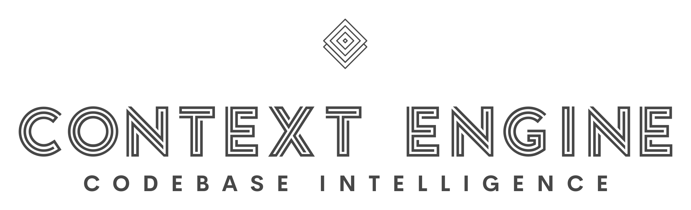

<p align="center">
  
</p>

<h1 align="center">Context Engine</h1>

<p align="center">
  <strong>Semantic code search, memory, and symbol intelligence for AI coding assistants.</strong>
</p>

<p align="center">
  <a href="https://context-engine.ai">Website</a> · <a href="https://context-engine.ai">Get Started</a> · <a href="LICENSE">License</a>
</p>

---

## A Note to Our Community

We owe you an honest explanation.

Context Engine was originally open source. We built it in the open because we believed in the community and wanted developers everywhere to benefit from better code search.

Unfortunately, we've seen our work consistently monetized and cloned by others without attribution — entire products built on top of our code and sold commercially. After careful consideration, we've made the difficult decision to remove the source code from this repository.

**We're sorry.** We know this is frustrating, especially for those who contributed, starred, or relied on the public codebase. This wasn't the outcome we wanted, and we take full responsibility for not protecting the project sooner.

**What's still here:**
- AI agent skills for all major coding assistants (see below)
- The Context Engine marketing site ([context-engine.ai](https://context-engine.ai))
- License, legal notices, and attribution files

**What's available through the platform:**
- Full hosted service at [context-engine.ai](https://context-engine.ai)
- VS Code extension on the marketplace
- `ctx-mcp-bridge` on npm

We remain committed to building the best code intelligence tools for developers. If you have questions, reach out at **john@context-engine.ai**.

---

## Install Skills

Context Engine ships AI agent skills that teach your coding assistant how to use 30+ MCP tools for semantic search, symbol graph navigation, memory, and more.

### Claude Code / Claude Desktop

The skill is auto-loaded when you connect Context Engine as an MCP server. No manual installation needed.

If you want to add the rules file manually:

```bash
# Copy the skill to your project
cp -r skills/context-engine/ your-project/.claude/

# Or reference GEMINI.md / .cursorrules directly — they contain the same rules
```

### Cursor

Context Engine rules are included in `.cursorrules` at the root of your workspace. Cursor picks this up automatically when the file is present.

```bash
# Copy to your project root
cp .cursorrules your-project/.cursorrules
```

### Windsurf / Codex

```bash
# Codex skills
cp -r .codex/skills/ your-project/.codex/skills/

# Or use the generic skill file
cp skills/context-engine/SKILL.md your-project/.context-engine-skill.md
```

### Augment Code

```bash
cp -r .augment/ your-project/.augment/
```

### Gemini

```bash
cp GEMINI.md your-project/GEMINI.md
```

### Any Other Assistant

The core skill file works with any AI assistant that supports custom instructions:

```bash
cp skills/context-engine/SKILL.md your-project/
```

Then tell your assistant: *"Read SKILL.md for instructions on using Context Engine MCP tools."*

---

## What Do the Skills Do?

The skills teach your AI assistant to:

- **Use `search` as the default tool** — auto-routes queries to the best backend (semantic search, Q&A, symbol graph, tests, config)
- **Navigate code with `symbol_graph`** — find callers, callees, definitions, importers, subclasses
- **Run batch queries** — `batch_search`, `batch_symbol_graph`, `batch_graph_query` for 75%+ token savings
- **Store and recall knowledge** — `memory_store` and `memory_find` for persistent context across sessions
- **Trace cross-repo flows** — `cross_repo_search` with boundary tracing for multi-repo codebases
- **Find structural patterns** — `pattern_search` for retry loops, error handling, singletons across languages
- **Search git history** — `search_commits_for` and `change_history_for_path`

See [`skills/context-engine/SKILL.md`](skills/context-engine/SKILL.md) for the complete tool reference.

---

## Getting Started

1. **Sign up** at [context-engine.ai](https://context-engine.ai)
2. **Install the VS Code extension** — search "Context Engine" in the marketplace
3. **Upload your codebase** — the extension handles indexing automatically
4. **Start searching** — your AI assistant now has access to all 30+ MCP tools

---

## License

[Context-Engine Source Available License 1.0](LICENSE)

© 2025 Context Engine Inc. and John Donalson.
